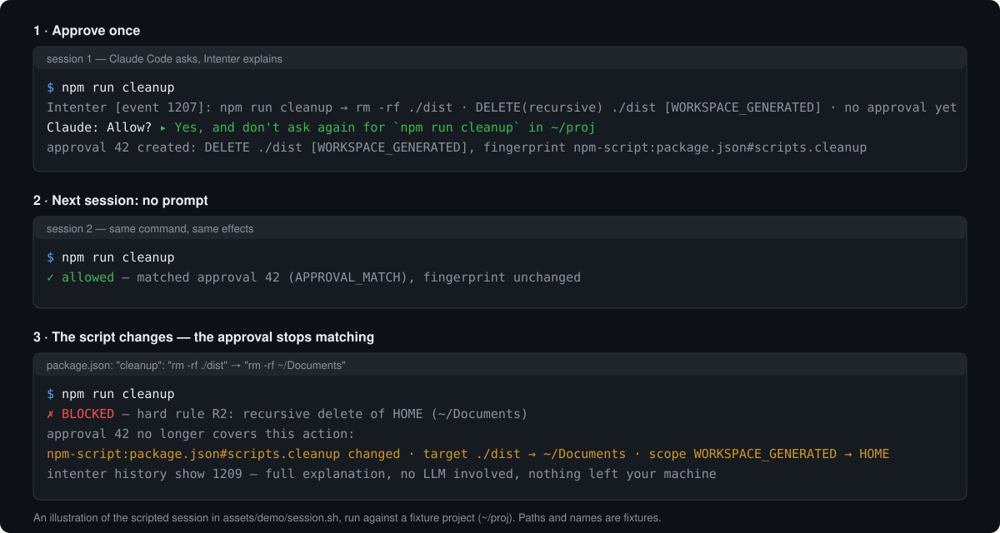
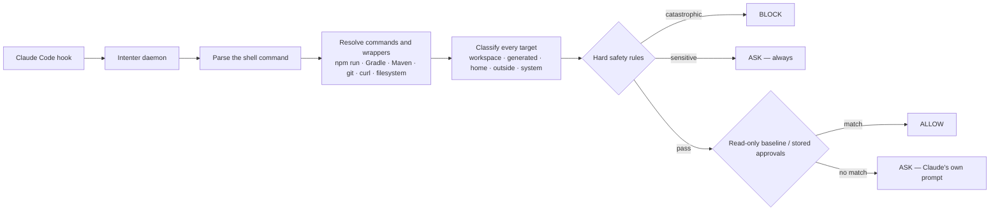

# Intenter — Semantic Permissions for AI Coding Agents

**Stop approving command strings. Approve what commands actually do.**

[](LICENSE)
[](docs/install.md)
<!-- after-repository-is-public: a shields badge for a repository GitHub cannot
see renders "repo not found", which is worse than no badge. Enable these two the
day the repository goes public; see docs/release-process.md#badges.
[](https://github.com/Vadym903/Intenter/actions/workflows/ci.yml)
[](go.mod)
-->
<!-- after-first-release: a latest-release badge with no releases renders an
error image. Enable these two once the first tag is published.
[](https://github.com/Vadym903/Intenter/releases/latest)
[](https://github.com/Vadym903/Intenter/releases)
-->

Intenter is a local, deterministic permission layer for AI coding agents that approves what a command actually does, not the string it was typed as.

It runs beside Claude Code on macOS, Linux and Windows as a hook. Before a shell
command executes, Intenter resolves it to its real effects — what it reads,
writes, deletes or executes, and where — then decides from those effects rather
than from the command text. Approvals remember the resolved behavior across
sessions and stop applying the moment the script behind a command changes.

The result is fewer Claude Code permission prompts without turning permissions
off, and a stricter gate than a command-string allowlist. There is no language
model, telemetry or cloud service anywhere in the decision path.

**Install** — macOS and Linux:

```sh
curl -fsSL https://raw.githubusercontent.com/Vadym903/Intenter/main/install.sh | sh
```

Windows (PowerShell 5.1 or 7, no administrator rights):

```powershell
irm https://raw.githubusercontent.com/Vadym903/Intenter/main/install.ps1 | iex
```

Then connect it to Claude Code: `intenter setup claude`

[](assets/demo/intenter.svg)

<sub>An illustration of the scripted session in `assets/demo/session.sh`, which runs against the real binary and a fixture project ([how it is made](assets/demo/README.md)). The [getting-started walkthrough](docs/getting-started.md) reproduces it with a real Claude Code session.</sub>

**Contents:** [Why](#why) · [How it works](#how-it-works) · [What you get](#what-you-get) · [Compared to alternatives](#compared-to-alternatives) · [Requirements](#requirements) · [Install](#install) · [Set up Claude Code](#set-up-claude-code) · [Try it](#try-it) · [CLI at a glance](#cli-at-a-glance) · [Security & limitations](#security--limitations) · [Updating](#updating) · [Configuration](#configuration) · [FAQ](#faq) · [Documentation](#documentation) · [Status & roadmap](#status--roadmap) · [Contributing](#contributing) · [License](#license)

## Why

AI coding agents ask for permission constantly. By the tenth identical prompt,
people stop reading and click allow, write a broad rule such as
`Bash(npm run *)`, or switch permissions off. The first two approve a *string* —
and what a string does is decided by files the agent itself can edit.

When you let Claude Code run `npm run cleanup`, you are approving whatever that
script contains *today*. A string rule keeps matching after someone edits
`package.json`:

```diff
 "scripts": {
-  "cleanup": "rm -rf ./dist"
+  "cleanup": "rm -rf ~/Documents"
 }
```

Intenter resolves the command before deciding, and remembers what it resolved
to — together with a fingerprint of every mutable input it read on the way.
Same three words, different behavior, different decision:

```text
$ npm run cleanup                  # package.json: "cleanup": "rm -rf ./dist"
  resolved  DELETE ./dist          scope WORKSPACE_GENERATED
  decision  ASK → approved once, remembered across sessions

  ... package.json changes: "cleanup": "rm -rf ~/Documents" ...

$ npm run cleanup                  # the same three words
  resolved  DELETE ~/Documents     scope HOME
  approval 42 no longer covers this action:
    npm-script:package.json#scripts.cleanup changed
    target ./dist -> ~/Documents
    scope WORKSPACE_GENERATED -> HOME (DELETE)
  decision  BLOCK — recursive delete inside your home directory (hard rule)
```

So you get fewer prompts *and* a stricter floor than an allowlist: repeated,
unchanged actions stop interrupting you, while a small set of hard rules blocks
catastrophic actions — or forces a confirmation for merely dangerous ones — no
matter what was approved before ([how it works](docs/how-it-works.md),
[security model](docs/security-model.md)).

## How it works

Intenter is a single Go binary that acts as three things: the hook Claude Code
calls, a per-user background daemon that decides, and the CLI you use to inspect
and manage approvals.



- **Resolution** parses the command with a real shell grammar — POSIX for
  `sh`/`bash`/`zsh`, separate parsers for `cmd.exe` and PowerShell — then follows
  wrappers to what they actually run. `npm run cleanup` is looked up in
  `package.json`; Gradle and Maven tasks map to the work they declare. Every path
  is made absolute against the command's effective directory and resolved through
  symlinks, because a delete follows the link, not the spelling.
- **Hard safety rules** are a small, fixed set no approval can override. Some
  block outright: recursive deletes in your home directory, deletes outside the
  project, destructive changes to system locations, changes to credential files.
  Others force a prompt even when an approval exists: reading a credential file,
  force-pushing to a protected branch, discarding uncommitted work, elevated
  privileges, disabled TLS verification, piping a download into a shell
  ([the rules](docs/security-model.md#what-it-is-for)).
- **Anything Intenter cannot fully resolve is asked**, never guessed safe. A
  command built at runtime, or hidden inside an opaque string such as
  `bash -c '…'`, goes to Claude's own prompt
  ([the decision](docs/how-it-works.md#the-decision)). Incomplete evidence never
  becomes an allow.
- **Reads inside your project** are allowed without asking, so `git status`,
  `grep -r` and `cat README.md` do not interrupt you. Anything sensitive, outside
  the project, or that writes goes through the normal path.
- **Approvals** cover everything else. An approval records the resolved effects —
  operation, targets, scopes — plus fingerprints of the mutable inputs the
  resolution depended on: `package.json` scripts and npm shell configuration,
  Gradle and Maven build files, lockfiles. Change one and the approval stops
  matching, and the prompt names which one
  ([invalidation](docs/how-it-works.md#fingerprints-and-invalidation)).

Every decision is made on your machine and is deterministic: the same resolved
action, project context and stored approvals always produce the same answer, and
`intenter history show` can explain it from the audit record months later. The
same *raw* command can legitimately get a different answer — when the script,
target or configuration behind it changed, that is the point
([why there is no AI in it](docs/faq.md#why-is-there-no-ai-in-it)).

## What you get

- **Fewer prompts, not looser rules** — approve an action once and matching
  actions stop asking, across Claude Code sessions
  ([approvals](docs/how-it-works.md#exact-and-semantic-approvals)).
- **Approvals that expire when behavior changes** — a changed script, target,
  scope or build configuration means the old approval no longer matches
  ([invalidation](docs/how-it-works.md#fingerprints-and-invalidation)).
- **A safety floor no approval can lower** — catastrophic deletes and credential
  changes are blocked; sensitive reads, protected-branch force pushes and
  download-to-shell pipes always ask
  ([hard rules](docs/security-model.md#what-it-is-for)).
- **An explanation for every allow and block** — `intenter history show <id>`
  names the rule or approval that decided, and what changed
  ([`history show`](docs/cli/intenter_history_show.md)).
- **A visible gate** — an allow that one of your approvals produced says so in
  one line, so a working gate is never indistinguishable from an absent one; when
  a session ends, Intenter reports what it decided and how many prompts an
  approval answered for you ([`summary`](docs/cli/intenter_summary.md)).
- **Deterministic and local** — no model in the loop, no telemetry, no account;
  decisions never touch the network
  ([security model](docs/security-model.md#what-stays-on-your-machine)).
- **One-line install on macOS, Linux and Windows** — checksum-verified,
  signature-verified wherever `openssl`, PowerShell 7 or `cosign` is available,
  upgradable and removable with the same command ([install](docs/install.md)).
- **Updates that ask first** — one terminal prompt when a new release exists:
  update now, not now, or skip this version ([updates](docs/updates.md)).
- **A scriptable CLI** — every list and show command takes `--json`
  ([CLI reference](docs/cli/README.md)).

## Compared to alternatives

Intenter runs on top of Claude Code's native permission system, as a hook. The
table compares *what is trusted and what gets re-checked* — not a claim that
Claude Code's own rules and modes do nothing. They do, and they evolve with
Claude Code releases.

| | What is trusted | After the script behind the command changes | Decided by | Remembered across sessions |
|---|---|---|---|---|
| Claude Code allow rule, e.g. `Bash(npm run *)` | a command-string pattern | still matches, by design; deny rules still apply | string match | yes — the string |
| Claude Code "Yes, and don't ask again" | that command string, per project | still matches | string match | yes — the string |
| Claude Code auto mode | each tool call, reviewed by a classifier model | reviewed again as a fresh call; nothing is remembered about what the script resolved to | a model, per call | no |
| Claude Code `bypassPermissions` (`--dangerously-skip-permissions`) | every command; prompts are skipped | nothing is re-checked | — | — |
| Approving every prompt by hand | one call at a time | only if you re-read the script and notice | you | no |
| **Intenter** | the resolved effects plus fingerprints of their inputs | the approval stops matching; the command is re-resolved and decided again | deterministic rules and stored approvals | **yes — the behavior, per project** |

- A native rule that keeps matching a command string after the script behind it
  changes is working as designed. Intenter's difference is that it re-resolves
  the behavior before reusing an approval, and binds the approval to fingerprints
  of the inputs that behavior depends on
  ([invalidation](docs/how-it-works.md#fingerprints-and-invalidation)).
- Intenter never overrides a Claude Code deny rule and only *adds* a semantic
  check. When you answer "Yes, and don't ask again", Claude writes a rule for the
  string; Intenter resolves the command, checks it against the hard rules, and
  records an approval for the resolved effects
  ([importing consent](docs/how-it-works.md#importing-dont-ask-again)).
- In `bypassPermissions` mode Intenter enforces only its hard-rule blocks — for
  every command it can resolve — and stays out of everything else
  ([bypass mode](docs/faq.md#what-about-bypass-mode)).
- Claude Code's own rules and modes are described in its documentation —
  [permissions](https://code.claude.com/docs/en/permissions) and
  [permission modes](https://code.claude.com/docs/en/permission-modes) — and
  change with releases; Intenter's approvals stay deterministic and local
  whichever mode you run in.

## Requirements

| | Supported |
|---|---|
| Operating systems | macOS, Linux, Windows |
| Architectures | amd64 and arm64 on all three |
| Agents | Claude Code 2.1 or newer, via its hooks |
| Tools gated | Claude's `Bash` and `PowerShell` tools |
| Privileges | None. No `sudo`, nothing written outside your user account |
| Runtime dependencies | None. A single static Go binary, no cgo |

Node.js is **not** required: Intenter reads `package.json` to resolve an
`npm run` script and never executes it to analyze it. You only need Node if you
want the command to actually run after being allowed. On Windows, install Git for
Windows — Claude Code's `Bash` tool uses Git Bash.

## Install

**Recommended — the one-line installer.** macOS and Linux:

```sh
curl -fsSL https://raw.githubusercontent.com/Vadym903/Intenter/main/install.sh | sh
```

Windows (PowerShell 5.1 or 7):

```powershell
irm https://raw.githubusercontent.com/Vadym903/Intenter/main/install.ps1 | iex
```

Both download the build for your machine from the GitHub release, verify its
checksum — and the release signature, when `openssl`, PowerShell 7 or `cosign` is
available — before installing anything, put `intenter` on your `PATH`, and print
the next step. The default location is `~/.local/bin` on macOS and Linux and
`%LOCALAPPDATA%\Intenter\bin` on Windows.

A running shell cannot be changed from outside, so **open a new terminal**, then
verify:

<!-- example -->
```console
$ intenter version
intenter 0.1.0
  engine   v1
  protocol v1
  schema   v1
  built    go1.22.5 (darwin/arm64)
```
<!-- /example -->

If the command is not found, the `PATH` entry has not reached this shell yet
([troubleshooting](docs/troubleshooting.md#intenter-command-not-found)).

**Pinning a version.** The one-liners install the newest release. To install a
specific one — in a Dockerfile, a provisioning script, or anywhere a surprise
upgrade would be unwelcome — pass it explicitly:

<!-- example -->
```sh
curl -fsSL https://raw.githubusercontent.com/Vadym903/Intenter/main/install.sh | sh -s -- --version 0.2.0
```

```powershell
& ([scriptblock]::Create((irm https://raw.githubusercontent.com/Vadym903/Intenter/main/install.ps1))) -Version 0.2.0
```
<!-- /example -->

**Upgrading.** Run the same one-liner again, or use `intenter update`. Your
approvals and history are untouched by an upgrade.

**Uninstalling.** `intenter uninstall claude` removes the Claude Code hooks and
the daemon while leaving the rest of your `settings.json` alone. To remove the
binary and the `PATH` entry too:

```sh
curl -fsSL https://raw.githubusercontent.com/Vadym903/Intenter/main/install.sh | sh -s -- --uninstall
```

Approvals and history are kept unless you add `--purge`.

Building from source works — it is plain Go with no cgo — and pinning a version,
installing without touching `PATH`, corporate proxies, air-gapped mirrors and
verifying a download by hand are all covered in
[docs/install.md](docs/install.md). The Homebrew and winget channels open with
the first stable release; winget is available once the manifest is accepted
upstream.

## Set up Claude Code

```sh
intenter setup claude
```

One command wires everything together. It finds your Claude Code installation,
backs up `~/.claude/settings.json` before touching it, adds Intenter's hooks
alongside any hooks you already have, creates the local approvals database,
registers the daemon as a per-user service — launchd on macOS, a systemd user
unit on Linux, a Run key on Windows — installs the terminal update check, and
runs a self-test through the full hook path so a broken install fails here rather
than mid-session ([`setup claude`](docs/cli/intenter_setup_claude.md)).

The hooks it installs are `PreToolUse` (the decision), `PermissionRequest` and
`PostToolUse` (recording what happened and importing your "don't ask again"
answers), and `SessionEnd` (the session summary). Nothing is registered as a
system-wide service and no step needs root.

Add `--dry-run` to see the plan without changing anything. Claude Code reads its
hook configuration once, when a session starts, so **restart any running Claude
Code sessions** afterwards. If anything looks wrong later, `intenter doctor`
checks the installation and prints a fix for each problem it finds.

## Try it

A ten-minute walkthrough from nothing to your first blocked command lives in
[docs/getting-started.md](docs/getting-started.md). In outline:

1. Create a project with a `cleanup` script and start Claude Code in it.
2. Ask Claude to run `npm run cleanup`. Claude asks; answer **"Yes, and don't
   ask again"**. Intenter turns that answer into an approval for the *resolved*
   effects, not the string.
3. Ask again in a new session — it runs without a prompt, and Intenter says which
   approval allowed it.
4. Edit `package.json` so `cleanup` deletes something outside the project.
5. Ask a third time — the approval no longer matches. The new behavior is decided
   on its own merits and blocked or explicitly confirmed, according to the hard
   rules, with an explanation of exactly what changed.

## CLI at a glance

| Command | What it does |
|---|---|
| `intenter setup claude` | Install the Claude Code integration |
| `intenter menu` | What this project allows, and what you can do about it |
| `intenter approvals` | List what is trusted here — Intenter's approvals and Claude's own rules |
| `intenter approval show <id>` | Show everything one approval covers |
| `intenter approval revoke <id>` | Take a permission away, including the agent rule behind it |
| `intenter approve <event-id>` | Remember the effects of an evaluated command |
| `intenter history` | The decision log |
| `intenter history show <id>` | Why one command was allowed, asked about or blocked |
| `intenter summary` | How much was decided, and how many prompts an approval answered |
| `intenter update` | Check for and install a new release |
| `intenter status` | Daemon, integration and recent activity |
| `intenter doctor` | Diagnose an installation, with fixes |
| `intenter uninstall claude` | Remove the Claude Code integration |

Every list and show command takes `--json`. `intenter daemon` manages the
background service directly. The full reference is in
[docs/cli/](docs/cli/README.md).

Inside a Claude Code session, **`/intenter`** opens the same thing without
leaving the conversation: what this project runs without a prompt, and every
action you can take, each with an example. Setup installs it; every action it
offers is also a command you can type in a terminal.

## Security & limitations

Intenter is a policy and control layer, **not a sandbox and not endpoint
protection**: a command it allows runs with your privileges and can do anything
you can. Read [docs/security-model.md](docs/security-model.md) before relying on
it. In short:

- **It gates Claude Code's shell tools only** — `Bash` and `PowerShell`. Claude's
  `Read`, `Write` and `Edit` tools do not go through a shell and are outside the
  prototype's coverage ([limitations](docs/security-model.md#limitations)).
- **It cannot see inside opaque strings.** `bash -c '…'`, `eval`, a command
  assembled at runtime: Intenter never approves these. Outside bypass mode they
  go to Claude's own prompt; in `bypassPermissions` mode Claude runs them as that
  mode intends ([bypass mode](docs/faq.md#what-about-bypass-mode)).
- **It decides from what it can resolve.** Unknown or unresolved behavior is
  never guessed safe — it is asked, and a command line Intenter could not examine
  to the end forces the prompt rather than being trusted.
- **Approvals never override the hard rules.** An approval can widen what is
  allowed; it cannot lower the safety floor.
- **A daemon that is down means "ask", never "allow"** — the hook says nothing
  and Claude's own permission flow decides, exactly as if Intenter were not
  installed ([fail-safe behavior](docs/security-model.md#fail-safe-behavior)).
- **It is not a network firewall.** Network effects are modelled for the programs
  Intenter resolves — `curl`, git, package managers — and judged as effects;
  nothing else about network traffic is controlled.
- **Nothing leaves your machine in a decision.** Approvals, history and
  configuration are stored locally, per user. The only outbound request the
  binary ever makes is the optional update check
  ([what stays on your machine](docs/security-model.md#what-stays-on-your-machine)).
- **Prototype status:** one agent, shell tools only, an approval schema that may
  still change; see [Status & roadmap](#status--roadmap).

## Updating

Intenter checks for new releases in the background and asks once, when you open
a terminal:

<!-- example -->
```text
Intenter 0.2.0 is available (you have 0.1.0).
Update now? [y]es / [N]ot now / [s]kip this version  (auto "not now" in 30s):
```
<!-- /example -->

Nothing is installed without a yes, nothing is checked from scripts, CI or Claude
sessions, and `INTENTER_NO_UPDATE_CHECK=1` (or `updates.check = false`) switches
the check off entirely. The check asks the public release page which version is
newest — no identifiers, nothing about you or your commands; like any HTTPS
request it still tells the release host your IP address. On demand,
`intenter update --check` shows what is available and `intenter update` installs
it after showing the plan and verifying the release signature and checksums
([docs/updates.md](docs/updates.md)).

## Configuration

Intenter works without configuration. When you want to change something, the
file is optional and per-user:

| | macOS | Linux | Windows |
|---|---|---|---|
| Config | `~/Library/Application Support/Intenter/config.toml` | `~/.config/intenter/config.toml` | `%APPDATA%\Intenter\config.toml` |
| Database | `~/Library/Application Support/Intenter/intenter.db` | `~/.local/share/intenter/intenter.db` | `%LOCALAPPDATA%\Intenter\intenter.db` |

The database holds your approvals, their fingerprints and the decision log.
`intenter status` prints the paths in use on your machine. The settings people
reach for most:

```toml
[policy]
allow_readonly_workspace = true          # let reads inside the project through
protected_branches = ["main", "master"]  # force a prompt on force-push/delete
sensitive_paths_extra = []               # more paths to treat as credentials

[scope]
generated_dirs_extra = []                # more directories to treat as build output

[updates]
check = true                             # the master switch for update checks
```

Restart the daemon after editing: `intenter daemon restart`. Every option is
documented in [docs/configuration.md](docs/configuration.md).

## FAQ

**What is Intenter?** A local, deterministic permission layer for AI coding
agents — today, Claude Code — that approves what a shell command actually does
rather than its text. Approvals persist across sessions and stop applying when
the behavior behind a command changes.

**Does Intenter use an LLM to make security decisions?** No. A decision is a
deterministic function of the resolved action, the project context, the hard
rules and your stored approvals — the same inputs give the same answer, offline
([why](docs/faq.md#why-is-there-no-ai-in-it)).

**Is Intenter a sandbox?** No. It decides *whether* a command runs; an allowed
command runs with your privileges. For containment, run the agent in a container
or VM — Intenter is useful there too
([security model](docs/security-model.md#limitations)).

**How is it different from a `Bash(npm run *)` allow rule?** That rule approves
the string and keeps matching after `package.json` changes. An Intenter approval
is bound to what the script resolved to and to a fingerprint of the script
itself; change either and it stops matching
([invalidation](docs/how-it-works.md#fingerprints-and-invalidation)).

**Is it a safer alternative to `--dangerously-skip-permissions`?** It is a way to
need bypass mode less: reads inside the project never prompt and approved
behavior stops prompting. If you do run in bypass mode, Intenter still enforces
its hard blocks for every command it can resolve
([bypass mode](docs/faq.md#what-about-bypass-mode)).

**Which agents and operating systems does it support?** Claude Code, through its
hooks, gating the `Bash` and `PowerShell` tools, on macOS, Linux and Windows
(amd64 and arm64). Other agents and editors are planned, not shipped
([roadmap](#status--roadmap)).

**Does Intenter send my code or commands anywhere?** No. No telemetry, no
account, no model calls; decisions never touch the network. The only outbound
request is an anonymous check for a newer release, which
`INTENTER_NO_UPDATE_CHECK=1` switches off
([FAQ](docs/faq.md#does-it-send-anything-anywhere)).

**Is Intenter open source? Can I use it at work?** It is source-available, not
open-source software in the OSI sense: free for personal and noncommercial use,
while commercial use requires a separate license. The source is public and every
rule is readable ([License](#license)).

## Documentation

- [Getting started](docs/getting-started.md) — the ten-minute walkthrough
- [How it works](docs/how-it-works.md) — resolution, scopes, the decision order,
  approvals and invalidation
- [Security model](docs/security-model.md) — the hard rules, the threat model,
  fail-safe behavior, what is not covered
- [Installing, upgrading and removing](docs/install.md)
- [Updating](docs/updates.md) — the terminal prompt and `intenter update`
- [Configuration](docs/configuration.md)
- [Troubleshooting](docs/troubleshooting.md)
- [FAQ](docs/faq.md)
- [CLI reference](docs/cli/README.md) — every command, flag and JSON shape
- [`llms.txt`](llms.txt) — a machine-readable summary for AI assistants and
  answer engines
- [Release process](docs/release-process.md) · [Changelog](CHANGELOG.md) · [Releases](https://github.com/Vadym903/Intenter/releases)

## Status & roadmap

**Implemented:** the Claude Code integration (`Bash` and `PowerShell` tools) on
macOS, Linux and Windows, exercised in CI on all three; script and wrapper
resolution for npm, pnpm, yarn, Gradle and Maven, plus git, curl and common file
commands in POSIX shells, cmd and PowerShell; the hard-rule safety floor; exact
and semantic approvals with fingerprint invalidation; one-line installers with
checksum and signature verification; signed releases that the self-updater
verifies; a terminal update check that asks first; and `history`, `summary`,
`status` and `doctor` tooling that explains every decision and diagnoses an
installation.

**Release status:** the automated suite runs on macOS, Linux and Windows in CI,
and the release pipeline installs every build with the real installers on all
three before publishing it. The hands-on walkthrough — a person running the demo
against a real Claude Code session — follows the
[validation template](docs/validation-template.md); no platform is claimed as
validated by hand until a completed record says so. The Homebrew and winget channels
are not open yet; winget becomes available once the manifest is accepted
upstream.

**Prototype status, stated plainly:** Claude Code is the only agent integrated,
shell tools are the only tools gated, and the approval database schema may change
before 1.0 — each such change is listed in the [changelog](CHANGELOG.md).

Claude Code is integrated however you run it, including inside VS Code: the
hooks live in `~/.claude/settings.json`, which the editor extension and the CLI
both read. That is Claude Code working in VS Code — not an Intenter extension
for VS Code, which does not exist.

**Planned:** adapters for other agents and editors (Codex, Cursor, JetBrains,
and an extension of Intenter's own) and a documentation website. Planned means
not shipped — nothing in this paragraph is available today.

## Contributing

Build, test and release instructions are in [CONTRIBUTING.md](CONTRIBUTING.md),
together with the [contribution terms](CONTRIBUTING.md#contribution-terms):
contributions are accepted under the project license with a sign-off and a
relicensing grant. Questions go to
[Discussions](https://github.com/Vadym903/Intenter/discussions); bugs to
[Issues](https://github.com/Vadym903/Intenter/issues); vulnerabilities via
[SECURITY.md](SECURITY.md).

## License

Intenter is source-available under the
[PolyForm Noncommercial License 1.0.0](LICENSE). Free for personal and
noncommercial use; commercial use requires a separate license. You may use, copy,
modify and share it for personal and other noncommercial purposes — hobby
projects, study, research, and the noncommercial organizations PolyForm covers.
Using it in a for-profit company's business, or selling it, is commercial use and
requires a separate commercial license — contact the maintainer in
[Discussions](https://github.com/Vadym903/Intenter/discussions). It is not
open-source software in the OSI sense: the source is public and every rule is
readable, but commercial use is reserved.
